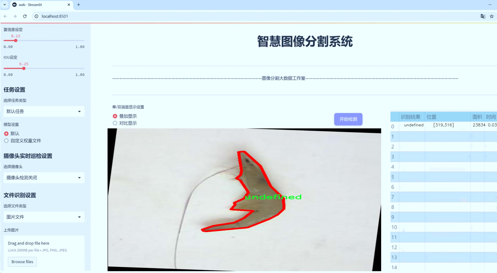
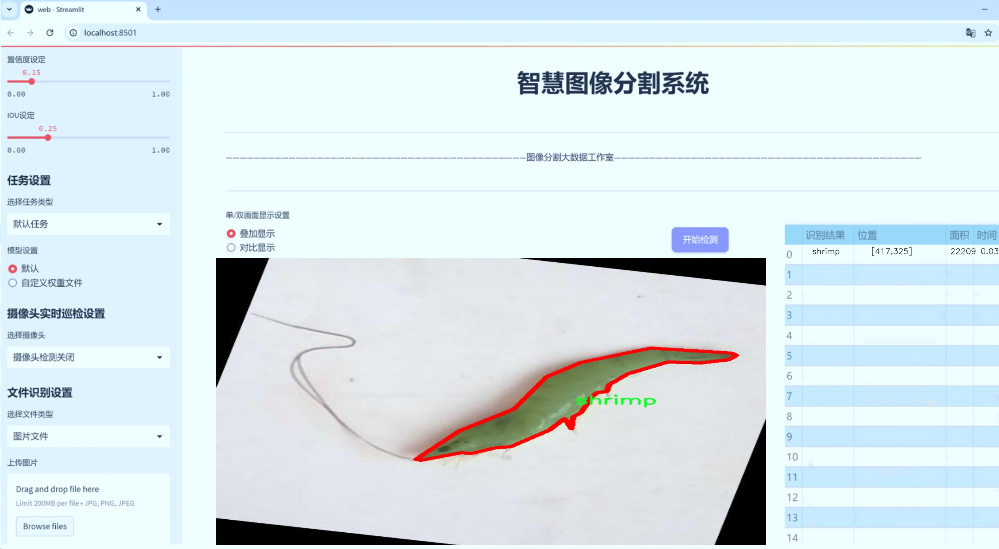
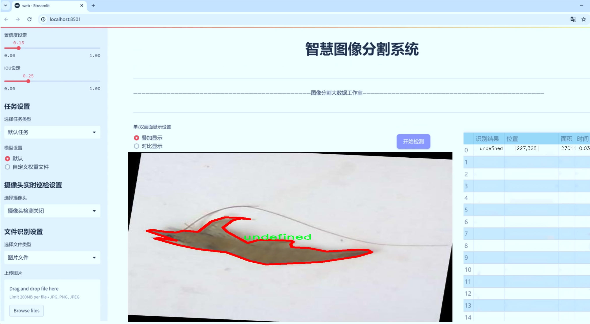
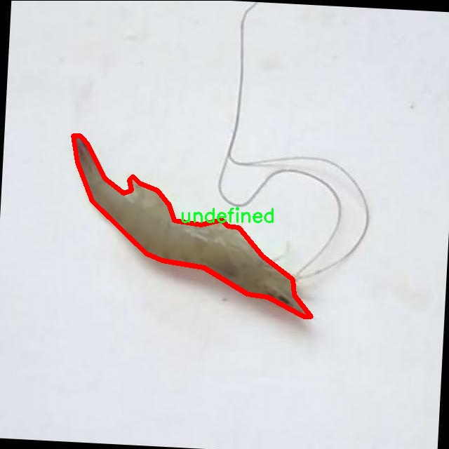
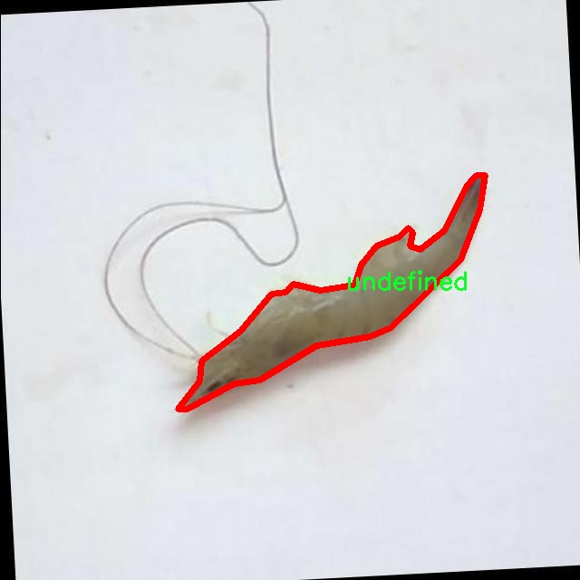
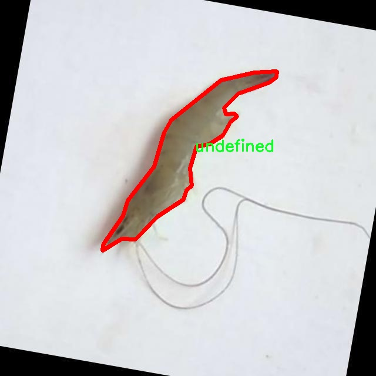
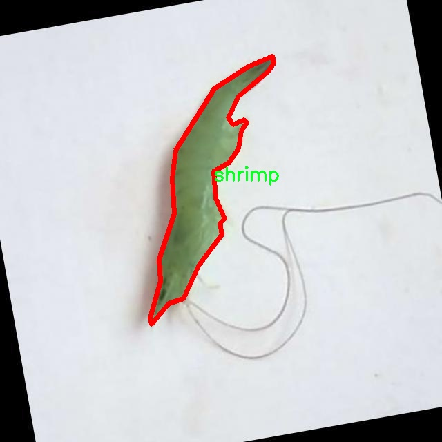
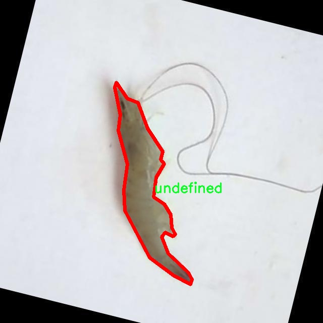

# 虾类图像分割系统源码＆数据集分享
 [yolov8-seg-slimneck＆yolov8-seg-convnextv2等50+全套改进创新点发刊_一键训练教程_Web前端展示]

### 1.研究背景与意义

项目参考[ILSVRC ImageNet Large Scale Visual Recognition Challenge](https://gitee.com/YOLOv8_YOLOv11_Segmentation_Studio/projects)

项目来源[AAAI Global Al lnnovation Contest](https://kdocs.cn/l/cszuIiCKVNis)

研究背景与意义

随着计算机视觉技术的迅速发展，深度学习在图像处理领域的应用越来越广泛，尤其是在目标检测和图像分割方面。YOLO（You Only Look Once）系列模型作为实时目标检测的代表，因其高效性和准确性而受到广泛关注。近年来，YOLOv8的推出更是推动了这一领域的进步，其在速度和精度上的显著提升使其成为图像分割任务中的重要工具。针对虾类的图像分割研究，不仅在水产养殖、生态监测等领域具有重要的应用价值，也为生物多样性保护和资源管理提供了科学依据。

虾类作为一种重要的水生经济动物，其生长、繁殖和生态习性受到环境变化的显著影响。为了有效监测虾类的生长状况和种群结构，传统的人工观察方法不仅耗时耗力，而且容易受到主观因素的影响，导致数据的准确性和可靠性不足。因此，基于计算机视觉的自动化监测系统显得尤为重要。通过对虾类图像进行高效的分割，可以实现对虾类个体的精准识别和计数，从而为水产养殖管理提供科学依据。

本研究基于改进的YOLOv8模型，旨在构建一个高效的虾类图像分割系统。所使用的数据集包含3200张图像，涵盖了5个类别，包括“area”、“object”、“shrimp”、“shrimp-DiNc”和“undefined”。这些类别的设置不仅能够帮助我们深入理解虾类的形态特征，还能为模型的训练提供丰富的样本数据。通过对这些图像的处理和分析，我们能够提取出虾类的关键特征，进而提高分割的准确性和鲁棒性。

在技术层面，YOLOv8模型的改进将集中在特征提取和分割精度的提升上。通过引入先进的卷积神经网络结构和优化算法，我们希望能够在保持实时性的同时，进一步提高对虾类图像的分割效果。此外，针对数据集中不同类别的特征差异，我们将采用数据增强技术，以增加模型的泛化能力，确保其在实际应用中的有效性。

本研究的意义不仅在于推动计算机视觉技术在水产养殖领域的应用，更在于为生态监测和生物多样性保护提供新的技术手段。通过建立一个高效的虾类图像分割系统，我们能够实现对虾类种群动态的实时监测，为科学研究和资源管理提供重要的数据支持。同时，该系统的成功应用也将为其他水生生物的监测和管理提供借鉴，推动相关领域的技术进步和发展。

综上所述，基于改进YOLOv8的虾类图像分割系统的研究，不仅具有重要的理论价值，也具有广泛的实际应用前景。通过这一研究，我们期望能够为水产养殖行业的智能化发展贡献力量，同时为生态保护和可持续发展提供科学依据。

### 2.图片演示







##### 注意：由于此博客编辑较早，上面“2.图片演示”和“3.视频演示”展示的系统图片或者视频可能为老版本，新版本在老版本的基础上升级如下：（实际效果以升级的新版本为准）

  （1）适配了YOLOV8的“目标检测”模型和“实例分割”模型，通过加载相应的权重（.pt）文件即可自适应加载模型。

  （2）支持“图片识别”、“视频识别”、“摄像头实时识别”三种识别模式。

  （3）支持“图片识别”、“视频识别”、“摄像头实时识别”三种识别结果保存导出，解决手动导出（容易卡顿出现爆内存）存在的问题，识别完自动保存结果并导出到tempDir中。

  （4）支持Web前端系统中的标题、背景图等自定义修改，后面提供修改教程。

  另外本项目提供训练的数据集和训练教程,暂不提供权重文件（best.pt）,需要您按照教程进行训练后实现图片演示和Web前端界面演示的效果。

### 3.视频演示

[3.1 视频演示](https://www.bilibili.com/video/BV12Q18YUEab/)

### 4.数据集信息展示

##### 4.1 本项目数据集详细数据（类别数＆类别名）

nc: 4
names: ['area', 'object', 'shrimp', 'undefined']


##### 4.2 本项目数据集信息介绍

数据集信息展示

在本研究中，我们采用了名为“2501241101”的数据集，以支持对虾类图像分割系统的训练，特别是针对改进YOLOv8-seg模型的应用。该数据集的构建旨在为计算机视觉领域的虾类识别和分割任务提供丰富而多样的样本，确保模型在实际应用中的有效性和准确性。

“2501241101”数据集包含四个主要类别，分别为“area”、“object”、“shrimp”和“undefined”。这些类别的选择反映了虾类图像分割任务的复杂性和多样性。首先，“area”类别代表了图像中可能存在的不同区域，这些区域可能是虾类栖息的环境或背景，能够帮助模型更好地理解虾类的生存空间。其次，“object”类别则用于标识图像中出现的其他物体，这些物体可能与虾类的生活环境相关，或者是干扰因素，能够为模型提供更多的上下文信息。

最为关键的“shrimp”类别，专门用于标识图像中的虾类对象。这一类别的标注要求高精度和细致入微的分割，以确保模型能够准确识别和定位虾类。通过对这一类别的深入学习，模型能够掌握虾类的形态特征、颜色变化及其在不同环境下的表现，从而提升分割的准确性和鲁棒性。最后，“undefined”类别则用于处理那些无法明确归类的区域，这一类别的存在有助于模型在面对复杂场景时，保持灵活性和适应性。

数据集“2501241101”的构建过程注重多样性和代表性，确保涵盖了不同种类的虾类及其栖息环境。数据集中的图像来源广泛，包括自然水域、养殖场以及实验室环境，力求为模型提供全面的训练素材。这种多样化的样本选择不仅增强了模型的泛化能力，还使其在面对不同场景时，能够保持高效的识别和分割性能。

在数据预处理阶段，我们对图像进行了标准化处理，以确保输入数据的一致性。此外，针对每个类别的标注，我们采用了严格的标注规范，确保每个图像中的虾类及相关对象均被准确标识。这一过程不仅提高了数据集的质量，也为后续的模型训练奠定了坚实的基础。

综上所述，数据集“2501241101”在虾类图像分割任务中扮演着至关重要的角色。通过精心设计的类别结构和丰富的样本来源，该数据集为改进YOLOv8-seg模型提供了强有力的支持，推动了计算机视觉技术在水产养殖及生态监测等领域的应用。随着研究的深入，我们期待这一数据集能够为未来的虾类识别和分割研究提供更多的启示和借鉴。











### 5.全套项目环境部署视频教程（零基础手把手教学）

[5.1 环境部署教程链接（零基础手把手教学）](https://www.bilibili.com/video/BV1jG4Ve4E9t/?vd_source=bc9aec86d164b67a7004b996143742dc)


[5.2 安装Python虚拟环境创建和依赖库安装视频教程链接（零基础手把手教学）](https://www.bilibili.com/video/BV1nA4VeYEze/?vd_source=bc9aec86d164b67a7004b996143742dc)

### 6.手把手YOLOV8-seg训练视频教程（零基础小白有手就能学会）

[6.1 手把手YOLOV8-seg训练视频教程（零基础小白有手就能学会）](https://www.bilibili.com/video/BV1cA4VeYETe/?vd_source=bc9aec86d164b67a7004b996143742dc)


按照上面的训练视频教程链接加载项目提供的数据集，运行train.py即可开始训练



     Epoch   gpu_mem       box       obj       cls    labels  img_size
     1/200     0G   0.01576   0.01955  0.007536        22      1280: 100%|██████████| 849/849 [14:42<00:00,  1.04s/it]
               Class     Images     Labels          P          R     mAP@.5 mAP@.5:.95: 100%|██████████| 213/213 [01:14<00:00,  2.87it/s]
                 all       3395      17314      0.994      0.957      0.0957      0.0843

     Epoch   gpu_mem       box       obj       cls    labels  img_size
     2/200     0G   0.01578   0.01923  0.007006        22      1280: 100%|██████████| 849/849 [14:44<00:00,  1.04s/it]
               Class     Images     Labels          P          R     mAP@.5 mAP@.5:.95: 100%|██████████| 213/213 [01:12<00:00,  2.95it/s]
                 all       3395      17314      0.996      0.956      0.0957      0.0845

     Epoch   gpu_mem       box       obj       cls    labels  img_size
     3/200     0G   0.01561    0.0191  0.006895        27      1280: 100%|██████████| 849/849 [10:56<00:00,  1.29it/s]
               Class     Images     Labels          P          R     mAP@.5 mAP@.5:.95: 100%|███████   | 187/213 [00:52<00:00,  4.04it/s]
                 all       3395      17314      0.996      0.957      0.0957      0.0845


### 7.50+种全套YOLOV8-seg创新点代码加载调参视频教程（一键加载写好的改进模型的配置文件）

[7.1 50+种全套YOLOV8-seg创新点代码加载调参视频教程（一键加载写好的改进模型的配置文件）](https://www.bilibili.com/video/BV1Hw4VePEXv/?vd_source=bc9aec86d164b67a7004b996143742dc)

### 8.YOLOV8-seg图像分割算法原理

原始YOLOV8-seg算法原理

YOLOv8-seg算法是2023年由Ultralytics推出的一款先进的目标检测与分割模型，它在YOLO系列的基础上进行了多项创新，结合了前辈算法的优点，尤其是YOLOX、YOLOv6、YOLOv7和PPYOLOE等，为实时目标检测和图像分割领域带来了新的突破。YOLOv8-seg不仅在精度和速度上表现出色，而且其灵活的模型设计使其能够适应多种应用场景，尤其是在农业自动化领域的应用潜力巨大。

YOLOv8-seg的网络结构可以分为输入层、主干网络、颈部网络和头部网络四个主要部分。输入层负责对图像进行预处理和缩放，以满足模型的输入要求。主干网络则通过一系列卷积操作对输入图像进行特征提取，采用了批归一化和SiLU激活函数，以增强模型的非线性表达能力。主干网络的设计灵活多样，提供了n、s、m、l、x五种不同尺度的模型，用户可以根据具体需求选择合适的模型。特别是YOLOv8n模型，作为最小的模型，依然保持了良好的性能，适合资源受限的应用场景。

在主干网络中，YOLOv8-seg引入了C2f模块，这一模块的设计灵感来源于YOLOv7中的E-ELAN结构，旨在通过跨层分支连接来增强梯度流动，进而改善检测和分割的效果。C2f模块相较于传统的C3模块，增加了更多的残差连接，这不仅提升了特征的表达能力，也在轻量化的基础上确保了模型的高效性。主干网络的末尾采用了SPPFl块，利用多个最大池化层来处理多尺度特征，从而增强了网络对不同尺度目标的识别能力。

颈部网络则是YOLOv8-seg的核心部分，采用了PAN-FPN结构来融合来自不同尺度的特征图信息。通过这一结构，模型能够有效地整合低层次的细节信息与高层次的语义信息，从而提升目标检测和分割的精度。颈部网络的设计充分考虑了特征图之间的上下文关系，使得模型在处理复杂场景时能够更好地理解目标之间的相互关系。

在头部网络中，YOLOv8-seg采用了解耦合的检测头结构，将分类和回归任务分开处理。这一设计的优势在于可以独立优化分类和回归的损失函数，进而提高模型的整体性能。同时，YOLOv8-seg摒弃了传统的Anchor-Based方法，转而采用Anchor-Free的策略，这一转变使得模型在处理目标形状和大小变化时更加灵活，能够适应更广泛的应用场景。

在训练过程中，YOLOv8-seg引入了动态Task-Aligned Assigner样本分配策略，结合了数据增强技术，以提高模型的泛化能力。特别是在最后的10个训练周期中，关闭马赛克增强，进一步提升了模型在特定任务上的表现。此外，YOLOv8-seg在损失计算方面采用了BCELoss作为分类损失，DFLLoss和CIoULoss作为回归损失，这一组合有效地提升了模型在复杂场景下的检测和分割精度。

YOLOv8-seg的创新设计使其在实时目标检测和分割任务中展现出卓越的性能，尤其是在农业自动化领域的应用，如苹果采摘等场景。通过结合视觉识别能力，YOLOv8-seg能够自动检测和定位苹果，为自动采摘机器人提供精确的目标信息。同时，结合蚁群算法进行路径规划，进一步提升了自动采摘的效率和准确性。这一系列的创新和优化使得YOLOv8-seg不仅在学术研究中具有重要意义，也在实际应用中展现出广泛的前景。

总之，YOLOv8-seg算法的原理不仅体现在其结构设计的创新上，更在于其在实际应用中的灵活性和高效性。通过不断优化和迭代，YOLOv8-seg为目标检测和分割领域提供了新的思路和方法，推动了相关技术的发展。随着技术的不断进步，YOLOv8-seg将为更多领域的自动化和智能化应用奠定基础，展现出更为广阔的应用前景。


### 9.系统功能展示（检测对象为举例，实际内容以本项目数据集为准）

图9.1.系统支持检测结果表格显示

  图9.2.系统支持置信度和IOU阈值手动调节

  图9.3.系统支持自定义加载权重文件best.pt(需要你通过步骤5中训练获得)

  图9.4.系统支持摄像头实时识别

  图9.5.系统支持图片识别

  图9.6.系统支持视频识别

  图9.7.系统支持识别结果文件自动保存

  图9.8.系统支持Excel导出检测结果数据


### 10.50+种全套YOLOV8-seg创新点原理讲解（非科班也可以轻松写刊发刊，V11版本正在科研待更新）

#### 10.1 由于篇幅限制，每个创新点的具体原理讲解就不一一展开，具体见下列网址中的创新点对应子项目的技术原理博客网址【Blog】：


[10.1 50+种全套YOLOV8-seg创新点原理讲解链接](https://gitee.com/qunmasj/good)

#### 10.2 部分改进模块原理讲解(完整的改进原理见上图和技术博客链接)【如果此小节的图加载失败可以通过CSDN或者Github搜索该博客的标题访问原始博客，原始博客图片显示正常】

### Gold-YOLO


#### Preliminaries
YOLO系列的中间层结构采用了传统的FPN结构，其中包含多个分支用于多尺度特征融合。然而，它只充分融合来自相邻级别的特征，对于其他层次的信息只能间接地进行“递归”获取。

传统的FPN结构在信息传输过程中存在丢失大量信息的问题。这是因为层之间的信息交互仅限于中间层选择的信息，未被选择的信息在传输过程中被丢弃。这种情况导致某个Level的信息只能充分辅助相邻层，而对其他全局层的帮助较弱。因此，整体上信息融合的有效性可能受到限制。
为了避免在传输过程中丢失信息，本文采用了一种新颖的“聚集和分发”机制（GD），放弃了原始的递归方法。该机制使用一个统一的模块来收集和融合所有Level的信息，并将其分发到不同的Level。通过这种方式，作者不仅避免了传统FPN结构固有的信息丢失问题，还增强了中间层的部分信息融合能力，而且并没有显著增加延迟。


#### 低阶聚合和分发分支 Low-stage gather-and-distribute branch
从主干网络中选择输出的B2、B3、B4、B5特征进行融合，以获取保留小目标信息的高分辨率特征。


#### 高阶聚合和分发分支 High-stage gather-and-distribute branch
高级全局特征对齐模块（High-GD）将由低级全局特征对齐模块（Low-GD）生成的特征{P3, P4, P5}进行融合。


Transformer融合模块由多个堆叠的transformer组成，transformer块的数量为L。每个transformer块包括一个多头注意力块、一个前馈网络（FFN）和残差连接。采用与LeViT相同的设置来配置多头注意力块，使用16个通道作为键K和查询Q的头维度，32个通道作为值V的头维度。为了加速推理过程，将层归一化操作替换为批归一化，并将所有的GELU激活函数替换为ReLU。为了增强变换器块的局部连接，在两个1x1卷积层之间添加了一个深度卷积层。同时，将FFN的扩展因子设置为2，以在速度和计算成本之间取得平衡。


信息注入模块(Information injection module)： 高级全局特征对齐模块（High-GD）中的信息注入模块与低级全局特征对齐模块（Low-GD）中的相同。在高级阶段，局部特征（Flocal）等于Pi，因此公式如下所示：


#### 增强的跨层信息流动 Enhanced cross-layer information flow
为了进一步提升性能，从YOLOv6 中的PAFPN模块中得到启发，引入了Inject-LAF模块。该模块是注入模块的增强版，包括了一个轻量级相邻层融合（LAF）模块，该模块被添加到注入模块的输入位置。为了在速度和准确性之间取得平衡，设计了两个LAF模型：LAF低级模型和LAF高级模型，分别用于低级注入（合并相邻两层的特征）和高级注入（合并相邻一层的特征）。它们的结构如图5(b)所示。为了确保来自不同层级的特征图与目标大小对齐，在实现中的两个LAF模型仅使用了三个操作符：双线性插值（上采样过小的特征）、平均池化（下采样过大的特征）和1x1卷积（调整与目标通道不同的特征）。模型中的LAF模块与信息注入模块的结合有效地平衡了准确性和速度之间的关系。通过使用简化的操作，能够增加不同层级之间的信息流路径数量，从而提高性能而不显著增加延迟。


### 11.项目核心源码讲解（再也不用担心看不懂代码逻辑）

#### 11.1 ultralytics\nn\extra_modules\afpn.py

以下是经过精简和注释的核心代码部分，主要保留了关键的网络结构和功能模块。

```python
import torch
import torch.nn as nn
import torch.nn.functional as F
from ..modules.conv import Conv

# 基本的卷积块，包含两个卷积层和残差连接
class BasicBlock(nn.Module):
    def __init__(self, filter_in, filter_out):
        super(BasicBlock, self).__init__()
        self.conv1 = Conv(filter_in, filter_out, 3)  # 第一个卷积层
        self.conv2 = Conv(filter_out, filter_out, 3, act=False)  # 第二个卷积层，不使用激活函数

    def forward(self, x):
        residual = x  # 保存输入以便进行残差连接
        out = self.conv1(x)  # 通过第一个卷积层
        out = self.conv2(out)  # 通过第二个卷积层
        out += residual  # 残差连接
        return self.conv1.act(out)  # 返回激活后的输出

# 上采样模块
class Upsample(nn.Module):
    def __init__(self, in_channels, out_channels, scale_factor=2):
        super(Upsample, self).__init__()
        self.upsample = nn.Sequential(
            Conv(in_channels, out_channels, 1),  # 1x1卷积层
            nn.Upsample(scale_factor=scale_factor, mode='bilinear')  # 双线性插值上采样
        )

    def forward(self, x):
        return self.upsample(x)  # 前向传播

# 自适应特征融合模块（ASFF），用于融合不同尺度的特征
class ASFF(nn.Module):
    def __init__(self, num_levels, inter_dim=512):
        super(ASFF, self).__init__()
        self.inter_dim = inter_dim
        compress_c = 8  # 压缩通道数

        # 为每个输入特征图生成权重
        self.weight_levels = nn.Conv2d(compress_c * num_levels, num_levels, kernel_size=1)
        self.convs = Conv(self.inter_dim, self.inter_dim, 3)  # 融合后的卷积层

    def forward(self, *inputs):
        # 计算每个输入的权重
        weights = [Conv(self.inter_dim, compress_c, 1)(input) for input in inputs]
        levels_weight_v = torch.cat(weights, 1)  # 拼接权重
        levels_weight = self.weight_levels(levels_weight_v)  # 计算最终权重
        levels_weight = F.softmax(levels_weight, dim=1)  # 归一化权重

        # 融合特征图
        fused_out_reduced = sum(input * levels_weight[:, i:i+1, :, :] for i, input in enumerate(inputs))
        return self.convs(fused_out_reduced)  # 返回融合后的特征图

# 主体网络结构
class BlockBody(nn.Module):
    def __init__(self, channels):
        super(BlockBody, self).__init__()
        self.blocks = nn.ModuleList([BasicBlock(channels[i], channels[i]) for i in range(len(channels))])  # 创建多个基本块
        self.asff = ASFF(len(channels))  # 创建自适应特征融合模块

    def forward(self, x):
        # 对每个输入特征图进行处理
        processed = [block(x[i]) for i, block in enumerate(self.blocks)]
        return self.asff(*processed)  # 通过ASFF融合特征图

# 主网络结构
class AFPN(nn.Module):
    def __init__(self, in_channels, out_channels):
        super(AFPN, self).__init__()
        self.convs = nn.ModuleList([Conv(in_channels[i], in_channels[i] // 4, 1) for i in range(len(in_channels))])  # 1x1卷积
        self.body = BlockBody([in_channels[i] // 4 for i in range(len(in_channels))])  # 主体网络

        # 输出卷积层
        self.output_convs = nn.ModuleList([Conv(in_channels[i] // 4, out_channels, 1) for i in range(len(in_channels))])

    def forward(self, x):
        # 通过卷积层处理输入
        processed = [conv(x[i]) for i, conv in enumerate(self.convs)]
        out = self.body(processed)  # 通过主体网络
        return [output_conv(out[i]) for i, output_conv in enumerate(self.output_convs)]  # 输出结果

# 自定义AFPN网络
class AFPN_Custom(AFPN):
    def __init__(self, in_channels, out_channels, block_type='C2f'):
        super().__init__(in_channels, out_channels)
        self.body = BlockBody_Custom([in_channels[i] // 4 for i in range(len(in_channels))], block_type)  # 使用自定义块

```

### 代码说明：
1. **BasicBlock**: 实现了一个基本的卷积块，包含两个卷积层和残差连接。
2. **Upsample**: 实现了上采样模块，使用1x1卷积和双线性插值进行上采样。
3. **ASFF**: 自适应特征融合模块，能够根据输入特征图的权重进行加权融合。
4. **BlockBody**: 组合多个基本块和ASFF模块，形成网络的主体结构。
5. **AFPN**: 主网络结构，负责输入特征图的处理和输出结果的生成。
6. **AFPN_Custom**: 允许使用自定义的基本块替代默认的基本块。

以上代码结构清晰，功能模块化，便于后续的扩展和修改。

该文件定义了一些用于构建特征金字塔网络（FPN）的模块，主要包括基本的卷积块、上采样和下采样模块，以及自适应特征融合模块（ASFF）。这些模块可以用于构建更复杂的网络结构，如AFPN（自适应特征金字塔网络）。

首先，`BasicBlock`类定义了一个基本的卷积块，包含两个卷积层，第二个卷积层不使用激活函数。该块的前向传播实现了残差连接，即输入与卷积输出相加，增强了网络的学习能力。

接下来，`Upsample`和`Downsample_x2`、`Downsample_x4`、`Downsample_x8`类分别实现了上采样和不同倍数的下采样操作。上采样使用了双线性插值，而下采样则通过卷积层实现。

`ASFF_2`、`ASFF_3`和`ASFF_4`类实现了自适应特征融合模块，分别用于融合两个、三个和四个输入特征图。每个模块通过计算输入特征图的权重，使用softmax函数进行归一化，然后根据权重对输入特征图进行加权求和，最后通过卷积层进行处理。这种方式可以有效地融合不同尺度的特征，提高模型的表现。

`BlockBody_P345`和`BlockBody_P2345`类则是构建特征金字塔的主体部分，分别用于处理三个和四个输入特征图。它们包含多个卷积块和自适应特征融合模块，负责在不同尺度上进行特征提取和融合。每个块都通过下采样和上采样操作来连接不同尺度的特征图。

`AFPN_P345`和`AFPN_P2345`类是完整的自适应特征金字塔网络结构，分别处理三个和四个输入特征图。它们在初始化时定义了输入通道、输出通道和特征图的缩放因子，并在前向传播中依次处理输入特征图，经过卷积和BlockBody的处理后输出最终的特征图。

最后，`AFPN_P345_Custom`和`AFPN_P2345_Custom`类允许用户自定义块类型，增强了网络的灵活性和可扩展性。

总体来说，该文件实现了自适应特征金字塔网络的核心模块，旨在提高多尺度特征的融合能力，从而提升目标检测等任务的性能。

#### 11.2 ultralytics\utils\ops.py

以下是代码中最核心的部分，并附上详细的中文注释：

```python
import torch
import torchvision

def non_max_suppression(
        prediction,
        conf_thres=0.25,
        iou_thres=0.45,
        classes=None,
        agnostic=False,
        multi_label=False,
        labels=(),
        max_det=300,
        nc=0,  # 类别数量（可选）
        max_time_img=0.05,
        max_nms=30000,
        max_wh=7680,
):
    """
    对一组边界框执行非最大抑制（NMS），支持掩码和每个框多个标签。

    参数:
        prediction (torch.Tensor): 形状为 (batch_size, num_classes + 4 + num_masks, num_boxes) 的张量，
            包含预测的框、类别和掩码。张量应符合模型输出格式，例如 YOLO。
        conf_thres (float): 置信度阈值，低于该值的框将被过滤掉。有效值在 0.0 和 1.0 之间。
        iou_thres (float): IoU 阈值，低于该值的框在 NMS 过程中将被过滤掉。有效值在 0.0 和 1.0 之间。
        classes (List[int]): 要考虑的类别索引列表。如果为 None，则考虑所有类别。
        agnostic (bool): 如果为 True，模型对类别数量不敏感，所有类别将被视为一个类别。
        multi_label (bool): 如果为 True，每个框可能有多个标签。
        labels (List[List[Union[int, float, torch.Tensor]]]): 每个图像的先验标签列表。
        max_det (int): NMS 后要保留的最大框数量。
        nc (int, optional): 模型输出的类别数量。任何超出此数量的索引将被视为掩码。
        max_time_img (float): 处理一张图像的最大时间（秒）。
        max_nms (int): 传递给 torchvision.ops.nms() 的最大框数量。
        max_wh (int): 最大框宽度和高度（像素）。

    返回:
        (List[torch.Tensor]): 长度为 batch_size 的列表，每个元素是形状为 (num_boxes, 6 + num_masks) 的张量，
            包含保留的框，列为 (x1, y1, x2, y2, confidence, class, mask1, mask2, ...)。
    """

    # 检查置信度和IoU阈值的有效性
    assert 0 <= conf_thres <= 1, f'Invalid Confidence threshold {conf_thres}, valid values are between 0.0 and 1.0'
    assert 0 <= iou_thres <= 1, f'Invalid IoU {iou_thres}, valid values are between 0.0 and 1.0'
    
    # 处理预测输出
    if isinstance(prediction, (list, tuple)):  # YOLOv8模型在验证模式下，输出 = (推理输出, 损失输出)
        prediction = prediction[0]  # 选择仅推理输出

    device = prediction.device  # 获取设备信息
    mps = 'mps' in device.type  # 检查是否为Apple MPS
    if mps:  # MPS尚未完全支持，NMS前将张量转换为CPU
        prediction = prediction.cpu()
    
    bs = prediction.shape[0]  # 批大小
    nc = nc or (prediction.shape[1] - 4)  # 类别数量
    nm = prediction.shape[1] - nc - 4  # 掩码数量
    mi = 4 + nc  # 掩码起始索引
    xc = prediction[:, 4:mi].amax(1) > conf_thres  # 置信度候选框

    # 设置时间限制
    time_limit = 0.5 + max_time_img * bs  # 超过此时间限制将退出
    multi_label &= nc > 1  # 多标签框（增加0.5ms/图像）

    prediction = prediction.transpose(-1, -2)  # 形状转换
    prediction[..., :4] = xywh2xyxy(prediction[..., :4])  # 将xywh转换为xyxy

    output = [torch.zeros((0, 6 + nm), device=prediction.device)] * bs  # 初始化输出
    for xi, x in enumerate(prediction):  # 遍历每张图像的推理结果
        x = x[xc[xi]]  # 根据置信度筛选框

        # 如果没有剩余框，处理下一张图像
        if not x.shape[0]:
            continue

        # 将检测矩阵分割为框、类别和掩码
        box, cls, mask = x.split((4, nc, nm), 1)

        if multi_label:
            i, j = torch.where(cls > conf_thres)  # 获取满足置信度的索引
            x = torch.cat((box[i], x[i, 4 + j, None], j[:, None].float(), mask[i]), 1)  # 合并框和标签
        else:  # 仅保留最佳类别
            conf, j = cls.max(1, keepdim=True)
            x = torch.cat((box, conf, j.float(), mask), 1)[conf.view(-1) > conf_thres]

        # 按类别过滤
        if classes is not None:
            x = x[(x[:, 5:6] == torch.tensor(classes, device=x.device)).any(1)]

        n = x.shape[0]  # 框的数量
        if not n:  # 如果没有框
            continue
        if n > max_nms:  # 如果框数量超过最大限制
            x = x[x[:, 4].argsort(descending=True)[:max_nms]]  # 按置信度排序并移除多余框

        # 批量NMS
        c = x[:, 5:6] * (0 if agnostic else max_wh)  # 类别
        boxes, scores = x[:, :4] + c, x[:, 4]  # 框（按类别偏移），分数
        i = torchvision.ops.nms(boxes, scores, iou_thres)  # 执行NMS
        i = i[:max_det]  # 限制检测数量

        output[xi] = x[i]  # 保存输出
        if (time.time() - t) > time_limit:  # 检查时间限制
            break  # 超过时间限制，退出

    return output  # 返回保留的框
```

### 代码核心部分说明：
1. **非最大抑制 (NMS)**：这是目标检测中常用的后处理步骤，用于去除重叠的框，只保留最有可能的框。
2. **参数设置**：包括置信度阈值、IoU阈值、类别选择等，确保只保留有效的检测结果。
3. **框的筛选和处理**：根据置信度和类别对框进行筛选，最终返回处理后的框信息。

以上代码片段及其注释为理解YOLO模型中非最大抑制的实现提供了清晰的视角。

这个程序文件是Ultralytics YOLO模型的一部分，主要包含了一些与图像处理、坐标转换、非极大值抑制（NMS）和性能分析相关的函数和类。文件的主要功能是为YOLO模型提供必要的操作和工具，以便在目标检测任务中进行高效的推理和后处理。

首先，文件中定义了一个`Profile`类，用于性能分析。这个类可以作为装饰器或上下文管理器使用，能够记录代码块的执行时间，方便开发者评估代码的性能。

接下来，文件中有多个函数。`segment2box`函数将分割标签转换为边界框标签，并确保这些框在图像内部。`scale_boxes`函数则用于将边界框从一个图像的尺寸缩放到另一个图像的尺寸，考虑了图像的填充和比例。

`make_divisible`函数用于返回一个最接近的可被指定除数整除的数字，这在处理模型参数时非常有用。`non_max_suppression`函数实现了非极大值抑制，能够有效地从多个重叠的边界框中筛选出最优的框，支持多标签和掩码的处理。

文件中还包含了一些坐标转换函数，例如`xyxy2xywh`和`xywh2xyxy`，用于在不同的边界框表示法之间进行转换。`clip_boxes`和`clip_coords`函数用于将边界框和坐标限制在图像的边界内，确保不会出现超出图像范围的情况。

对于分割掩码的处理，文件中提供了`scale_image`、`process_mask`和`masks2segments`等函数，能够对掩码进行缩放、裁剪和转换为分段表示。这些函数对于处理分割任务中的掩码非常重要。

此外，文件还包含了一些用于图像和掩码的转换函数，如`convert_torch2numpy_batch`，将PyTorch张量转换为NumPy数组，方便后续处理和可视化。`clean_str`函数用于清理字符串，替换特殊字符为下划线，这在处理文件名或标签时非常有用。

总体而言，这个文件为YOLO模型提供了许多基础的图像处理和后处理功能，确保在目标检测和分割任务中能够高效、准确地处理数据。

#### 11.3 ultralytics\nn\extra_modules\rep_block.py

以下是代码中最核心的部分，并附上详细的中文注释：

```python
import torch
import torch.nn as nn
import torch.nn.functional as F

# 定义一个类，表示多分支块（DiverseBranchBlock）
class DiverseBranchBlock(nn.Module):
    def __init__(self, in_channels, out_channels, kernel_size,
                 stride=1, padding=None, dilation=1, groups=1,
                 internal_channels_1x1_3x3=None,
                 deploy=False, single_init=False):
        super(DiverseBranchBlock, self).__init__()
        self.deploy = deploy  # 是否为部署模式
        self.nonlinear = Conv.default_act  # 非线性激活函数
        self.kernel_size = kernel_size  # 卷积核大小
        self.out_channels = out_channels  # 输出通道数
        self.groups = groups  # 分组卷积的组数
        
        # 自动计算填充
        if padding is None:
            padding = autopad(kernel_size, padding, dilation)
        assert padding == kernel_size // 2  # 确保填充正确

        # 如果是部署模式，使用重参数化卷积
        if deploy:
            self.dbb_reparam = nn.Conv2d(in_channels=in_channels, out_channels=out_channels, kernel_size=kernel_size, stride=stride,
                                      padding=padding, dilation=dilation, groups=groups, bias=True)
        else:
            # 原始卷积和批归一化
            self.dbb_origin = conv_bn(in_channels=in_channels, out_channels=out_channels, kernel_size=kernel_size, stride=stride, padding=padding, dilation=dilation, groups=groups)

            # 平均池化分支
            self.dbb_avg = nn.Sequential()
            if groups < out_channels:
                self.dbb_avg.add_module('conv',
                                        nn.Conv2d(in_channels=in_channels, out_channels=out_channels, kernel_size=1,
                                                  stride=1, padding=0, groups=groups, bias=False))
                self.dbb_avg.add_module('bn', BNAndPadLayer(pad_pixels=padding, num_features=out_channels))
                self.dbb_avg.add_module('avg', nn.AvgPool2d(kernel_size=kernel_size, stride=stride, padding=0))
                self.dbb_1x1 = conv_bn(in_channels=in_channels, out_channels=out_channels, kernel_size=1, stride=stride,
                                       padding=0, groups=groups)
            else:
                self.dbb_avg.add_module('avg', nn.AvgPool2d(kernel_size=kernel_size, stride=stride, padding=padding))

            self.dbb_avg.add_module('avgbn', nn.BatchNorm2d(out_channels))  # 添加批归一化层

            # 处理1x1和kxk卷积
            if internal_channels_1x1_3x3 is None:
                internal_channels_1x1_3x3 = in_channels if groups < out_channels else 2 * in_channels

            self.dbb_1x1_kxk = nn.Sequential()
            if internal_channels_1x1_3x3 == in_channels:
                self.dbb_1x1_kxk.add_module('idconv1', IdentityBasedConv1x1(channels=in_channels, groups=groups))
            else:
                self.dbb_1x1_kxk.add_module('conv1', nn.Conv2d(in_channels=in_channels, out_channels=internal_channels_1x1_3x3,
                                                            kernel_size=1, stride=1, padding=0, groups=groups, bias=False))
            self.dbb_1x1_kxk.add_module('bn1', BNAndPadLayer(pad_pixels=padding, num_features=internal_channels_1x1_3x3, affine=True))
            self.dbb_1x1_kxk.add_module('conv2', nn.Conv2d(in_channels=internal_channels_1x1_3x3, out_channels=out_channels,
                                                            kernel_size=kernel_size, stride=stride, padding=0, groups=groups, bias=False))
            self.dbb_1x1_kxk.add_module('bn2', nn.BatchNorm2d(out_channels))  # 添加第二个卷积的批归一化层

    # 前向传播
    def forward(self, inputs):
        if hasattr(self, 'dbb_reparam'):
            return self.nonlinear(self.dbb_reparam(inputs))  # 如果是部署模式，直接使用重参数化卷积

        out = self.dbb_origin(inputs)  # 原始卷积输出
        if hasattr(self, 'dbb_1x1'):
            out += self.dbb_1x1(inputs)  # 添加1x1卷积输出
        out += self.dbb_avg(inputs)  # 添加平均池化输出
        out += self.dbb_1x1_kxk(inputs)  # 添加kxk卷积输出
        return self.nonlinear(out)  # 返回经过非线性激活的输出

    # 切换到部署模式
    def switch_to_deploy(self):
        if hasattr(self, 'dbb_reparam'):
            return
        kernel, bias = self.get_equivalent_kernel_bias()  # 获取等效的卷积核和偏置
        self.dbb_reparam = nn.Conv2d(in_channels=self.dbb_origin.conv.in_channels, out_channels=self.dbb_origin.conv.out_channels,
                                     kernel_size=self.dbb_origin.conv.kernel_size, stride=self.dbb_origin.conv.stride,
                                     padding=self.dbb_origin.conv.padding, dilation=self.dbb_origin.conv.dilation, groups=self.dbb_origin.conv.groups, bias=True)
        self.dbb_reparam.weight.data = kernel  # 设置卷积核
        self.dbb_reparam.bias.data = bias  # 设置偏置
        for para in self.parameters():
            para.detach_()  # 分离参数
        self.__delattr__('dbb_origin')  # 删除原始卷积
        self.__delattr__('dbb_avg')  # 删除平均池化
        if hasattr(self, 'dbb_1x1'):
            self.__delattr__('dbb_1x1')  # 删除1x1卷积
        self.__delattr__('dbb_1x1_kxk')  # 删除kxk卷积
```

### 代码说明
1. **DiverseBranchBlock 类**：这是一个多分支卷积块，包含多个分支的卷积操作，包括原始卷积、1x1卷积、平均池化等。
2. **构造函数 `__init__`**：初始化卷积块的参数，包括输入输出通道、卷积核大小、步幅、填充等，并根据是否部署选择不同的卷积结构。
3. **前向传播 `forward`**：定义了如何通过该块进行前向传播，计算各个分支的输出并相加。
4. **切换到部署模式 `switch_to_deploy`**：在部署时，将多个分支的卷积操作合并为一个卷积操作，以提高推理效率。

以上是代码的核心部分及其详细注释，帮助理解其功能和结构。

这个程序文件定义了一个名为 `DiverseBranchBlock` 的神经网络模块，主要用于深度学习中的卷积操作。该模块的设计目的是通过多种分支的卷积操作来提高特征提取的能力。文件中包含了一些辅助函数和类，下面对其主要内容进行说明。

首先，文件导入了必要的库，包括 `torch` 和 `torch.nn`，这些是构建深度学习模型的基础库。接着，定义了一些辅助函数，这些函数主要用于卷积核和偏置的转换、合并以及填充操作。例如，`transI_fusebn` 函数用于将卷积层和批归一化层的参数融合，`transII_addbranch` 用于将多个卷积核和偏置相加，`transIII_1x1_kxk` 则处理1x1卷积和kxk卷积的组合。

接下来，定义了 `conv_bn` 函数，该函数创建一个包含卷积层和批归一化层的序列模块，方便后续的使用。然后，定义了 `IdentityBasedConv1x1` 类，这个类继承自 `nn.Conv2d`，实现了一个特殊的1x1卷积层，具有身份映射的特性。它的 `forward` 方法在进行卷积时，会将身份映射的卷积核加到权重上，从而实现特定的功能。

`BNAndPadLayer` 类是一个包含批归一化和填充操作的模块。它在前向传播时先进行批归一化，然后根据需要进行填充，确保输出的特征图在边缘的处理上更为精确。

`DiverseBranchBlock` 类是文件的核心部分。它在初始化时接收多个参数，包括输入通道数、输出通道数、卷积核大小等。根据这些参数，模块内部构建了多个卷积分支，包括原始卷积、1x1卷积、平均池化等。每个分支都通过批归一化层进行处理，以提高模型的稳定性和性能。

在 `DiverseBranchBlock` 中，还定义了一些方法，例如 `get_equivalent_kernel_bias` 用于获取等效的卷积核和偏置，`switch_to_deploy` 用于在推理阶段切换到简化的卷积层，以提高计算效率。`forward` 方法实现了模块的前向传播逻辑，将输入通过各个分支进行处理并相加，最后应用非线性激活函数。

此外，模块还提供了初始化方法，允许用户对批归一化层的权重进行特定的初始化设置，以便在训练过程中获得更好的效果。

总体来说，这个文件实现了一个复杂的卷积模块，利用多种卷积操作的组合来增强特征提取能力，适用于各种深度学习任务。

#### 11.4 ultralytics\nn\autobackend.py

以下是代码中最核心的部分，并附上详细的中文注释：

```python
class AutoBackend(nn.Module):
    """
    处理Ultralytics YOLO模型的动态后端选择，用于推理。
    该类提供了对多种推理引擎的抽象层，支持多种格式。
    """

    @torch.no_grad()
    def __init__(self, weights='yolov8n.pt', device=torch.device('cpu'), dnn=False, data=None, fp16=False, fuse=True, verbose=True):
        """
        初始化AutoBackend以进行推理。

        参数:
            weights (str): 模型权重文件的路径，默认为'yolov8n.pt'。
            device (torch.device): 运行模型的设备，默认为CPU。
            dnn (bool): 是否使用OpenCV DNN模块进行ONNX推理，默认为False。
            data (str | Path | optional): 包含类名的额外data.yaml文件的路径，默认为None。
            fp16 (bool): 是否启用半精度推理，仅在特定后端支持，默认为False。
            fuse (bool): 是否融合Conv2D + BatchNorm层以优化，默认为True。
            verbose (bool): 是否启用详细日志，默认为True。
        """
        super().__init__()
        # 处理权重文件路径
        w = str(weights[0] if isinstance(weights, list) else weights)
        # 检测模型类型
        pt, jit, onnx, xml, engine, coreml, saved_model, pb, tflite, edgetpu, tfjs, paddle, ncnn, triton = self._model_type(w)

        # 检查FP16支持
        fp16 &= pt or jit or onnx or xml or engine

        # 设置设备
        cuda = torch.cuda.is_available() and device.type != 'cpu'  # 使用CUDA
        if cuda and not any([nn_module, pt, jit, engine]):  # GPU数据加载格式
            device = torch.device('cpu')
            cuda = False

        # 如果权重文件不在本地，则尝试下载
        if not (pt or triton or nn_module):
            w = attempt_download_asset(w)

        # 加载模型
        if nn_module:  # 内存中的PyTorch模型
            model = weights.to(device)
            model = model.fuse(verbose=verbose) if fuse else model
            self.model = model  # 显式分配给self.model
        elif pt:  # PyTorch模型
            from ultralytics.nn.tasks import attempt_load_weights
            model = attempt_load_weights(weights if isinstance(weights, list) else w, device=device, inplace=True, fuse=fuse)
            self.model = model
        elif jit:  # TorchScript模型
            model = torch.jit.load(w, map_location=device)
            self.model = model
        elif dnn:  # ONNX OpenCV DNN
            net = cv2.dnn.readNetFromONNX(w)
        elif onnx:  # ONNX Runtime
            import onnxruntime
            session = onnxruntime.InferenceSession(w)
            self.session = session
        # 其他模型格式的加载过程省略...

        # 检查类名
        if 'names' not in locals():  # 如果类名缺失
            names = self._apply_default_class_names(data)
        names = check_class_names(names)

        # 禁用梯度计算
        if pt:
            for p in model.parameters():
                p.requires_grad = False

        self.__dict__.update(locals())  # 将所有局部变量分配给self

    def forward(self, im, augment=False, visualize=False):
        """
        在YOLOv8 MultiBackend模型上运行推理。

        参数:
            im (torch.Tensor): 要进行推理的图像张量。
            augment (bool): 是否在推理过程中进行数据增强，默认为False。
            visualize (bool): 是否可视化输出预测，默认为False。

        返回:
            (tuple): 包含原始输出张量和处理后的输出（如果visualize=True）。
        """
        b, ch, h, w = im.shape  # 获取输入图像的形状
        if self.fp16 and im.dtype != torch.float16:
            im = im.half()  # 转换为FP16格式

        # 根据模型类型进行推理
        if self.pt or self.nn_module:  # PyTorch
            y = self.model(im, augment=augment, visualize=visualize)
        elif self.jit:  # TorchScript
            y = self.model(im)
        elif self.dnn:  # ONNX OpenCV DNN
            im = im.cpu().numpy()  # 转换为numpy数组
            self.net.setInput(im)
            y = self.net.forward()
        elif self.onnx:  # ONNX Runtime
            im = im.cpu().numpy()
            y = self.session.run(self.output_names, {self.session.get_inputs()[0].name: im})
        # 其他模型推理过程省略...

        return self.from_numpy(y)  # 返回推理结果

    def from_numpy(self, x):
        """
        将numpy数组转换为张量。

        参数:
            x (np.ndarray): 要转换的数组。

        返回:
            (torch.Tensor): 转换后的张量。
        """
        return torch.tensor(x).to(self.device) if isinstance(x, np.ndarray) else x

    @staticmethod
    def _model_type(p='path/to/model.pt'):
        """
        根据模型文件路径返回模型类型。

        参数:
            p: 模型文件的路径，默认为'path/to/model.pt'。
        """
        from ultralytics.engine.exporter import export_formats
        sf = list(export_formats().Suffix)  # 获取支持的文件后缀
        name = Path(p).name
        types = [s in name for s in sf]  # 检查文件名后缀
        return types  # 返回模型类型
```

### 代码核心部分说明：
1. **AutoBackend类**：该类负责处理不同模型格式的加载和推理，支持多种后端（如PyTorch、ONNX等）。
2. **初始化方法**：根据输入的权重文件路径和其他参数，加载相应的模型，并进行必要的配置。
3. **forward方法**：执行推理，处理输入图像并返回结果。
4. **from_numpy方法**：将numpy数组转换为PyTorch张量。
5. **_model_type静态方法**：根据模型文件路径返回模型的类型，以便后续处理。

这段代码是YOLOv8模型推理的核心部分，涉及模型的加载、推理及数据处理等关键功能。

这个程序文件 `ultralytics/nnautobackend.py` 是 Ultralytics YOLO 模型的一个重要组成部分，主要负责动态选择后端以运行推理。文件中包含了一系列导入语句，涉及到常用的库如 `torch`、`cv2`、`numpy` 和 `PIL`，以及一些 Ultralytics 自己的工具函数和模块。

程序的核心是 `AutoBackend` 类，它继承自 `torch.nn.Module`，并提供了一个抽象层来支持多种推理引擎。该类支持多种模型格式，如 PyTorch、ONNX、TensorRT 等，每种格式都有特定的命名约定。类的构造函数 `__init__` 接受多个参数，包括模型权重路径、设备类型、是否使用 DNN 模块、数据配置文件路径等。构造函数内部会根据输入的模型格式动态加载相应的模型，并设置设备和其他相关参数。

在模型加载过程中，程序会检查模型的类型，并根据类型选择相应的加载方式。例如，对于 PyTorch 模型，会使用 `attempt_load_weights` 函数加载权重；对于 ONNX 模型，则会使用 OpenCV 的 DNN 模块或 ONNX Runtime。程序还会处理一些特殊情况，比如 TensorRT 和 CoreML 模型的加载。

此外，`AutoBackend` 类还实现了 `forward` 方法，该方法用于执行推理。它接受一个图像张量，并根据当前模型的类型调用相应的推理方法。无论是 PyTorch、ONNX 还是其他格式，程序都会将输入数据转换为适合该格式的形状，并返回推理结果。

类中还包含了一些辅助方法，比如 `from_numpy` 用于将 NumPy 数组转换为 PyTorch 张量，`warmup` 方法用于通过一次前向传播来预热模型，以提高后续推理的效率。

最后，程序还定义了一些静态方法，例如 `_apply_default_class_names` 和 `_model_type`，用于处理类名和模型类型的识别。这些方法帮助确保模型的输入和输出符合预期。

总的来说，这个文件为 Ultralytics YOLO 模型提供了灵活的后端支持，使得用户可以方便地在不同的推理引擎和设备上运行模型。

#### 11.5 ultralytics\cfg\__init__.py

以下是代码中最核心的部分，并附上详细的中文注释：

```python
def cfg2dict(cfg):
    """
    将配置对象转换为字典格式，可以是文件路径、字符串或SimpleNamespace对象。

    参数:
        cfg (str | Path | dict | SimpleNamespace): 要转换为字典的配置对象。

    返回:
        cfg (dict): 转换后的字典格式配置对象。
    """
    if isinstance(cfg, (str, Path)):
        cfg = yaml_load(cfg)  # 从文件加载字典
    elif isinstance(cfg, SimpleNamespace):
        cfg = vars(cfg)  # 将SimpleNamespace转换为字典
    return cfg


def get_cfg(cfg: Union[str, Path, Dict, SimpleNamespace] = DEFAULT_CFG_DICT, overrides: Dict = None):
    """
    从文件或字典加载并合并配置数据。

    参数:
        cfg (str | Path | Dict | SimpleNamespace): 配置数据。
        overrides (str | Dict | optional): 覆盖配置的文件名或字典。默认为None。

    返回:
        (SimpleNamespace): 训练参数的命名空间。
    """
    cfg = cfg2dict(cfg)

    # 合并覆盖配置
    if overrides:
        overrides = cfg2dict(overrides)
        if 'save_dir' not in cfg:
            overrides.pop('save_dir', None)  # 忽略特殊覆盖键
        check_dict_alignment(cfg, overrides)
        cfg = {**cfg, **overrides}  # 合并cfg和overrides字典（优先使用overrides）

    # 特殊处理数字类型的project/name
    for k in 'project', 'name':
        if k in cfg and isinstance(cfg[k], (int, float)):
            cfg[k] = str(cfg[k])
    if cfg.get('name') == 'model':  # 将模型名称赋值给'name'参数
        cfg['name'] = cfg.get('model', '').split('.')[0]
        LOGGER.warning(f"WARNING ⚠️ 'name=model' 自动更新为 'name={cfg['name']}'.")

    # 类型和值检查
    for k, v in cfg.items():
        if v is not None:  # None值可能来自可选参数
            if k in CFG_FLOAT_KEYS and not isinstance(v, (int, float)):
                raise TypeError(f"'{k}={v}' 的类型 {type(v).__name__} 无效. "
                                f"有效的 '{k}' 类型是 int（例如 '{k}=0'）或 float（例如 '{k}=0.5'）")
            elif k in CFG_FRACTION_KEYS:
                if not isinstance(v, (int, float)):
                    raise TypeError(f"'{k}={v}' 的类型 {type(v).__name__} 无效. "
                                    f"有效的 '{k}' 类型是 int（例如 '{k}=0'）或 float（例如 '{k}=0.5'）")
                if not (0.0 <= v <= 1.0):
                    raise ValueError(f"'{k}={v}' 的值无效. "
                                     f"有效的 '{k}' 值在 0.0 和 1.0 之间。")
            elif k in CFG_INT_KEYS and not isinstance(v, int):
                raise TypeError(f"'{k}={v}' 的类型 {type(v).__name__} 无效. "
                                f"'{k}' 必须是 int（例如 '{k}=8'）")
            elif k in CFG_BOOL_KEYS and not isinstance(v, bool):
                raise TypeError(f"'{k}={v}' 的类型 {type(v).__name__} 无效. "
                                f"'{k}' 必须是 bool（例如 '{k}=True' 或 '{k}=False'）")

    # 返回命名空间实例
    return IterableSimpleNamespace(**cfg)


def entrypoint(debug=''):
    """
    该函数是ultralytics包的入口点，负责解析传递给包的命令行参数。

    该函数允许：
    - 传递必需的YOLO参数作为字符串列表
    - 指定要执行的任务，例如'detect'、'segment'或'classify'
    - 指定模式，例如'train'、'val'、'test'或'predict'
    - 运行特殊模式，如'checks'
    - 向包的配置传递覆盖参数

    它使用包的默认配置并使用传递的覆盖参数初始化它。
    然后调用带有组合配置的CLI函数。
    """
    args = (debug.split(' ') if debug else sys.argv)[1:]
    if not args:  # 没有传递参数
        LOGGER.info(CLI_HELP_MSG)
        return

    # 处理特殊命令
    special = {
        'help': lambda: LOGGER.info(CLI_HELP_MSG),
        'checks': checks.collect_system_info,
        'version': lambda: LOGGER.info(__version__),
        'settings': lambda: handle_yolo_settings(args[1:]),
        'cfg': lambda: yaml_print(DEFAULT_CFG_PATH),
        'hub': lambda: handle_yolo_hub(args[1:]),
        'login': lambda: handle_yolo_hub(args),
        'copy-cfg': copy_default_cfg}

    # 解析参数并处理覆盖
    overrides = {}  # 基本覆盖，例如 imgsz=320
    for a in merge_equals_args(args):  # 合并'='周围的空格
        if '=' in a:
            try:
                k, v = parse_key_value_pair(a)
                overrides[k] = v
            except (NameError, SyntaxError, ValueError, AssertionError) as e:
                check_dict_alignment(full_args_dict, {a: ''}, e)

    # 检查键的对齐
    check_dict_alignment(full_args_dict, overrides)

    # 执行命令
    getattr(model, mode)(**overrides)  # 使用模型的默认参数运行命令

    # 显示帮助信息
    LOGGER.info(f'💡 了解更多信息请访问 https://docs.ultralytics.com/modes/{mode}')


if __name__ == '__main__':
    # 示例: entrypoint(debug='yolo predict model=yolov8n.pt')
    entrypoint(debug='')
```

### 代码核心部分解释：
1. **cfg2dict**: 将不同类型的配置对象（如字符串、路径或SimpleNamespace）转换为字典格式，方便后续处理。
2. **get_cfg**: 加载和合并配置数据，检查参数类型和有效性，并返回一个包含配置的命名空间对象。
3. **entrypoint**: 作为程序的入口点，解析命令行参数，处理特殊命令，并执行相应的YOLO任务。

这个程序文件是Ultralytics YOLO（You Only Look Once）模型的配置和命令行接口（CLI）处理代码。文件的主要功能是解析用户输入的命令行参数，加载和合并配置数据，并根据指定的任务和模式执行相应的操作。

首先，文件导入了一些必要的库和模块，包括用于路径处理的`Path`、用于类型注解的`Dict`、`List`和`Union`，以及Ultralytics库中的一些工具函数和常量。

接下来，定义了一些有效的任务和模式。任务包括目标检测（detect）、分割（segment）、分类（classify）和姿态估计（pose），而模式则包括训练（train）、验证（val）、预测（predict）、导出（export）、跟踪（track）和基准测试（benchmark）。这些任务和模式的映射关系被存储在字典中，方便后续使用。

文件中还定义了一些用于命令行帮助信息的字符串，提供了如何使用YOLO命令的示例，帮助用户理解如何传递参数和使用不同的功能。

在函数部分，`cfg2dict`函数用于将配置对象转换为字典格式，支持字符串、路径、字典和`SimpleNamespace`对象。`get_cfg`函数则用于加载和合并配置数据，支持从文件或字典中读取配置，并处理覆盖参数。它还会进行类型和数值检查，确保传入的参数符合预期的类型。

`get_save_dir`函数根据用户输入的参数生成保存目录，`_handle_deprecation`函数处理已弃用的配置键，确保向后兼容。`check_dict_alignment`函数检查自定义配置与基础配置之间的键是否匹配，若不匹配则提示用户。

`merge_equals_args`函数用于合并参数列表中的等号参数，确保解析正确。`handle_yolo_hub`和`handle_yolo_settings`函数分别处理与Ultralytics HUB和YOLO设置相关的命令行操作。

`entrypoint`函数是程序的入口点，负责解析命令行参数并根据指定的任务和模式执行相应的操作。它会处理特殊命令，如帮助信息、版本信息、设置管理等，并根据用户输入的参数构建配置，最终调用相应的模型方法执行任务。

最后，文件还定义了一个`copy_default_cfg`函数，用于复制默认配置文件，并在命令行中提供相应的示例。

整体而言，这个文件的结构清晰，功能模块化，便于扩展和维护，能够有效地支持YOLO模型的配置和命令行操作。

### 12.系统整体结构（节选）

### 程序整体功能和构架概括

该程序是Ultralytics YOLO（You Only Look Once）模型的实现，主要用于目标检测、分割和其他计算机视觉任务。整个程序的架构分为多个模块，每个模块负责特定的功能，以实现模型的构建、推理和配置管理。以下是各个模块的主要功能：

1. **特征提取和融合**：通过 `afpn.py` 和 `rep_block.py` 文件实现特征金字塔网络（FPN）和多分支卷积块，增强特征提取能力。
2. **图像处理和后处理**：`ops.py` 文件提供了图像处理、坐标转换和非极大值抑制等功能，确保模型输出的边界框和分割掩码的准确性。
3. **动态后端选择**：`autobackend.py` 文件实现了动态选择推理后端的功能，支持多种模型格式（如PyTorch、ONNX等），使得模型在不同环境中运行更加灵活。
4. **配置管理**：`__init__.py` 文件负责解析命令行参数和加载配置，支持用户自定义设置，确保模型的灵活性和可扩展性。

### 文件功能整理表

| 文件路径                                           | 功能描述                                                                                          |
|--------------------------------------------------|---------------------------------------------------------------------------------------------------|
| `ultralytics/nn/extra_modules/afpn.py`          | 实现自适应特征金字塔网络（AFPN）模块，包括卷积块、上采样和下采样操作，以及自适应特征融合模块。          |
| `ultralytics/utils/ops.py`                       | 提供图像处理、坐标转换、非极大值抑制（NMS）和性能分析等功能，支持目标检测和分割任务的后处理。           |
| `ultralytics/nn/extra_modules/rep_block.py`     | 定义多分支卷积块（DiverseBranchBlock），通过多种卷积操作增强特征提取能力，支持复杂的卷积结构。        |
| `ultralytics/nn/autobackend.py`                 | 动态选择推理后端，支持多种模型格式（如PyTorch、ONNX、TensorRT等），实现灵活的模型推理。               |
| `ultralytics/cfg/__init__.py`                   | 解析命令行参数和加载配置，支持用户自定义设置，管理模型的配置和命令行接口，确保模型的灵活性和可扩展性。 |

通过这些模块的协同工作，Ultralytics YOLO模型能够高效地进行目标检测和相关任务，提供了灵活的配置和推理选项，适应不同的应用场景。

注意：由于此博客编辑较早，上面“11.项目核心源码讲解（再也不用担心看不懂代码逻辑）”中部分代码可能会优化升级，仅供参考学习，完整“训练源码”、“Web前端界面”和“50+种创新点源码”以“14.完整训练+Web前端界面+50+种创新点源码、数据集获取”的内容为准。

### 13.图片、视频、摄像头图像分割Demo(去除WebUI)代码

在这个博客小节中，我们将讨论如何在不使用WebUI的情况下，实现图像分割模型的使用。本项目代码已经优化整合，方便用户将分割功能嵌入自己的项目中。
核心功能包括图片、视频、摄像头图像的分割，ROI区域的轮廓提取、类别分类、周长计算、面积计算、圆度计算以及颜色提取等。
这些功能提供了良好的二次开发基础。

### 核心代码解读

以下是主要代码片段，我们会为每一块代码进行详细的批注解释：

```python
import random
import cv2
import numpy as np
from PIL import ImageFont, ImageDraw, Image
from hashlib import md5
from model import Web_Detector
from chinese_name_list import Label_list

# 根据名称生成颜色
def generate_color_based_on_name(name):
    ......

# 计算多边形面积
def calculate_polygon_area(points):
    return cv2.contourArea(points.astype(np.float32))

...
# 绘制中文标签
def draw_with_chinese(image, text, position, font_size=20, color=(255, 0, 0)):
    image_pil = Image.fromarray(cv2.cvtColor(image, cv2.COLOR_BGR2RGB))
    draw = ImageDraw.Draw(image_pil)
    font = ImageFont.truetype("simsun.ttc", font_size, encoding="unic")
    draw.text(position, text, font=font, fill=color)
    return cv2.cvtColor(np.array(image_pil), cv2.COLOR_RGB2BGR)

# 动态调整参数
def adjust_parameter(image_size, base_size=1000):
    max_size = max(image_size)
    return max_size / base_size

# 绘制检测结果
def draw_detections(image, info, alpha=0.2):
    name, bbox, conf, cls_id, mask = info['class_name'], info['bbox'], info['score'], info['class_id'], info['mask']
    adjust_param = adjust_parameter(image.shape[:2])
    spacing = int(20 * adjust_param)

    if mask is None:
        x1, y1, x2, y2 = bbox
        aim_frame_area = (x2 - x1) * (y2 - y1)
        cv2.rectangle(image, (x1, y1), (x2, y2), color=(0, 0, 255), thickness=int(3 * adjust_param))
        image = draw_with_chinese(image, name, (x1, y1 - int(30 * adjust_param)), font_size=int(35 * adjust_param))
        y_offset = int(50 * adjust_param)  # 类别名称上方绘制，其下方留出空间
    else:
        mask_points = np.concatenate(mask)
        aim_frame_area = calculate_polygon_area(mask_points)
        mask_color = generate_color_based_on_name(name)
        try:
            overlay = image.copy()
            cv2.fillPoly(overlay, [mask_points.astype(np.int32)], mask_color)
            image = cv2.addWeighted(overlay, 0.3, image, 0.7, 0)
            cv2.drawContours(image, [mask_points.astype(np.int32)], -1, (0, 0, 255), thickness=int(8 * adjust_param))

            # 计算面积、周长、圆度
            area = cv2.contourArea(mask_points.astype(np.int32))
            perimeter = cv2.arcLength(mask_points.astype(np.int32), True)
            ......

            # 计算色彩
            mask = np.zeros(image.shape[:2], dtype=np.uint8)
            cv2.drawContours(mask, [mask_points.astype(np.int32)], -1, 255, -1)
            color_points = cv2.findNonZero(mask)
            ......

            # 绘制类别名称
            x, y = np.min(mask_points, axis=0).astype(int)
            image = draw_with_chinese(image, name, (x, y - int(30 * adjust_param)), font_size=int(35 * adjust_param))
            y_offset = int(50 * adjust_param)

            # 绘制面积、周长、圆度和色彩值
            metrics = [("Area", area), ("Perimeter", perimeter), ("Circularity", circularity), ("Color", color_str)]
            for idx, (metric_name, metric_value) in enumerate(metrics):
                ......

    return image, aim_frame_area

# 处理每帧图像
def process_frame(model, image):
    pre_img = model.preprocess(image)
    pred = model.predict(pre_img)
    det = pred[0] if det is not None and len(det)
    if det:
        det_info = model.postprocess(pred)
        for info in det_info:
            image, _ = draw_detections(image, info)
    return image

if __name__ == "__main__":
    cls_name = Label_list
    model = Web_Detector()
    model.load_model("./weights/yolov8s-seg.pt")

    # 摄像头实时处理
    cap = cv2.VideoCapture(0)
    while cap.isOpened():
        ret, frame = cap.read()
        if not ret:
            break
        ......

    # 图片处理
    image_path = './icon/OIP.jpg'
    image = cv2.imread(image_path)
    if image is not None:
        processed_image = process_frame(model, image)
        ......

    # 视频处理
    video_path = ''  # 输入视频的路径
    cap = cv2.VideoCapture(video_path)
    while cap.isOpened():
        ret, frame = cap.read()
        ......
```


### 14.完整训练+Web前端界面+50+种创新点源码、数据集获取


# [下载链接：https://mbd.pub/o/bread/Zp6WmJps](https://mbd.pub/o/bread/Zp6WmJps)